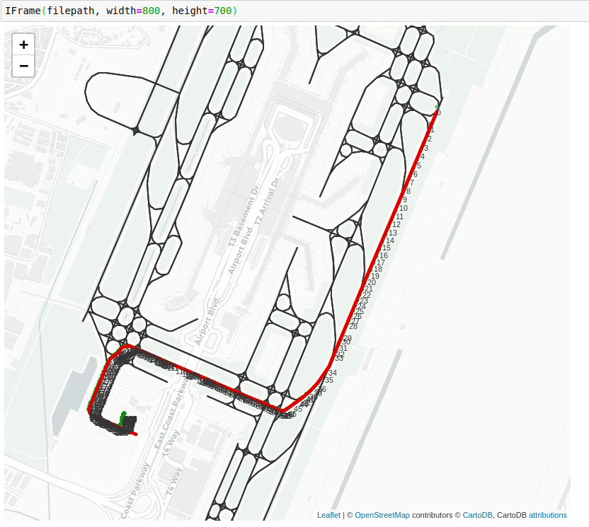

## Map-matching for airport surface movement

### Load Airport network

Load Changi airport network from YAML file or generate the new one from airport_graph_generate.ipynb file:

```python
import networkx as nx
from airportgraph import AirportGraph
G = nx.read_yaml('openstreetmap_changi_v2.yaml')
graph = AirportGraph(G)
```

### Load Flight data
The input of the map matching algorithm is a list of position data and their velocity information. 

There are available demo data in the form of flight data. 


```python
import json
from surfacemovement import Flight,
with open('test.json', 'r') as f:
    data = json.load(f)
flight_data = data['flights']['0']
flight = Flight.load_from_dict(flight_data)
```

### Map matching 

Create map matching object

```python
from mapmatching import WeightBasedMapMatching
map_matching = WeightBasedMapMatching(graph)
map_matching.set_verbal(False)
```

Run map matching process

```python
points, points_velocity, timestamp = flight.get_sampling(distance_diff=10)
best_route, accept_point_id = map_matching.run_v2(points, points_velocity)
segments = list(zip(best_route, best_route[1:]))
```

The result visualizing by folium



View the jupyter notebook file here: [Nbviewer-  map-matching-algorithm.ipynb](https://nbviewer.jupyter.org/github/strnam/airport_mapmatching/blob/master/map-matching-algorithm.ipynb)
